# 02 — Group Problem Statement

> Bản nộp nhóm. Đi từ 12 candidate problems của các thành viên → hội tụ về 1 candidate → validate + research → workflow trước/sau → Problem Statement → Rule / Workflow / Agent → quyết định cuối.
>
> Candidate được chọn: **Tự động hóa báo cáo tiến độ định kỳ từ hoạt động đã làm** (đại diện: Card #4 — báo cáo tiến độ đồ án hằng tuần).

---

## Phase 3 — Group Convergence

### Bước 3.1 — Trình bày: 12 candidate problems

| # | Người đưa ra | Candidate problem | Người gặp vấn đề | Điểm nghẽn |
|---|---|---|---|---|
| 1 | Nguyễn Thành Huy | Tổng hợp paper LLM hằng tuần | SV nghiên cứu AI | Đọc PDF + so sánh bằng bộ nhớ |
| 2 | Nguyễn Thành Huy | Viết báo cáo tuần nộp LMS | SV có deadline báo cáo định kỳ | Nhớ lại + viết thủ công từng mục |
| 3 | Nguyễn Thành Huy | Giải thích kỹ thuật cho gia đình | Người nhà không rành công nghệ | Giải thích lại nhiều lần, không lưu được |
| 4 | Nguyễn Đức Hiếu | Báo cáo tiến độ đồ án hằng tuần | SV năm cuối làm đồ án | Viết phần lý giải trễ + căn milestone |
| 5 | Nguyễn Đức Hiếu | Đọc & tóm tắt paper cho cơ sở lý thuyết | SV làm literature review | Không biết đọc paper nào + tổng hợp argument |
| 6 | Nguyễn Đức Hiếu | Tìm câu trả lời cũ trong Discord | Học viên trong khóa | Discord search không semantic, thread dài |
| 7 | Hồ Đức Minh | Đọc tài liệu dài trong khóa học | Học viên trước buổi lab | Đọc 20-40 trang mà không biết phần nào cần |
| 8 | Hồ Đức Minh | BA đổi nghiệp vụ sau khi dev code xong | Developer trong team có BA/PO | Spec thiếu edge case, phát hiện gap quá muộn |
| 9 | Hồ Đức Minh | Chuẩn bị update daily standup | Developer team Agile | Nhớ lại + format từ bộ nhớ ngắn hạn |
| 10 | Nguyễn Hữu Thái Minh | Weekly research update cho mảng computer vision | SV/researcher làm CV | Tổng hợp kết quả tuần trước, survey phương pháp, chốt 3 hướng demo — làm thủ công mất nhiều buổi |
| 11 | Nguyễn Hữu Thái Minh | Tìm lại quyết định nghiên cứu hoặc triển khai cũ | Thành viên nhóm nghiên cứu | Phải lục qua nhiều thread/chat/tài liệu, mất thời gian và dễ thiếu context |
| 12 | Nguyễn Hữu Thái Minh | Viết weekly progress note hoặc meeting summary cho mentor/nhóm | SV / researcher sau buổi họp | Biến ghi chú rời rạc thành bản update rõ ràng — khó tổng hợp kết quả, rủi ro và next step cho đủ |

### Bước 3.2 — Gom trùng / cluster

| Cluster | Candidates | Pattern chung |
|---|---|---|
| **A. Báo cáo / tổng hợp định kỳ** | #2, #4, #9, #10, #12 | Gom hoạt động đã làm (notes / commit / ticket / milestone / ghi chú họp) → viết lại theo format cố định cho người khác đọc, lặp lại theo chu kỳ |
| **B. Đọc & tổng hợp tài liệu dài** | #1, #5, #7 | Đọc tài liệu/paper dài → tóm tắt theo template → dùng lại để viết hoặc làm bài |
| **C. Tra cứu / hỏi-đáp thông tin có sẵn** | #3, #6, #11 | Trả lời câu hỏi mà thông tin đã tồn tại đâu đó (lịch sử chat, quyết định cũ, Discord), nhưng khó tìm hoặc khó diễn đạt lại |
| **D. Chất lượng spec / quy trình team** | #8 | Làm rõ yêu cầu đầy đủ trước khi bắt tay, tránh rework |

Quan sát: **Cluster A nay có 5 candidate từ nhiều thành viên** (#2, #4, #9, #10, #12) — tín hiệu pain chung mạnh nhất và nhất quán nhất trong nhóm. Các card mới (#10, #12) mở rộng bối cảnh từ đồ án sang nhóm nghiên cứu CV và meeting summary, nhưng cùng chung pattern *gom hoạt động đã làm → draft update theo format*. Cluster C cũng tăng thêm #11 (tìm lại quyết định cũ), xác nhận pain về tra cứu thông tin nội bộ.

### Bước 3.3 — Shortlist

Chọn ứng viên mạnh nhất từ 3 cluster đầu (cluster D loại sớm vì nhóm là sinh viên, ít ai đang ở môi trường BA–Dev thật nên khó validate trong lab).

| Candidate | Vì sao vào shortlist | Rủi ro / điều chưa rõ |
|---|---|---|
| #4 — Báo cáo tiến độ định kỳ (đại diện cluster A) | Workflow rõ nhất, nhiều thành viên cùng đau, metric thời gian đo được, dễ validate với bạn cùng khóa | "Báo cáo đủ tốt" đo bằng gì ngoài thời gian |
| #1 — Tổng hợp/đọc paper (đại diện cluster B) | Tốn thời gian lớn, AI thực sự hỗ trợ được phần đọc/tóm tắt | Chất lượng tóm tắt khó đo, rủi ro AI hiểu sai paper cao |
| #6 — Tìm câu trả lời cũ trong Discord (đại diện cluster C) | Nhiều người gặp, giảm câu hỏi trùng | Cần truy cập lịch sử chat → data access & privacy phức tạp |

### Bước 3.4 — Score để đồng thuận

Chấm 1-5 (5 = tốt nhất).

| Candidate | Actor rõ | Workflow rõ | Pain có evidence | Impact đo được | Làm trong lab | So sánh R/W/A | Nhóm hiểu domain | Tổng |
|---|---:|---:|---:|---:|---:|---:|---:|---:|
| #4 Báo cáo định kỳ | 5 | 5 | 5 | 5 | 5 | 5 | 5 | **35** |
| #1 Đọc/tóm tắt paper | 5 | 4 | 4 | 3 | 4 | 4 | 4 | 28 |
| #6 Discord search | 4 | 4 | 4 | 4 | 3 | 4 | 4 | 27 |

**Candidate nhóm chọn:** Card #4 — **Báo cáo tiến độ định kỳ từ hoạt động đã làm**.

**Vì sao chọn:**

- Là cluster lớn nhất (3/12 candidate) → pain chung và lặp lại của nhiều thành viên.
- Workflow tuyến tính, rõ từng bước, có baseline thời gian cụ thể.
- Đo được trực tiếp bằng phút và số lần GVHD/quản lý phải hỏi lại.
- So sánh được No AI / Rule / Workflow / Agent một cách rõ ràng.
- Câu trả lời trung thực là Workflow, không phải Agent → tránh bẫy "muốn làm AI cho ngầu".

**Vì sao không chọn 2 candidate còn lại:**

- #1 (paper): metric chất lượng tóm tắt khó thống nhất trong thời gian lab; rủi ro AI hiểu sai paper kỹ thuật rất cao, khó pilot nhỏ.
- #6 (Discord): cần quyền truy cập lịch sử chat + xử lý dữ liệu cá nhân học viên; data access & privacy là rào cản thật, khó chạy thử trong lab.

**Nếu có bất đồng:** ưu tiên candidate validate được nhanh nhất với chính các thành viên trong nhóm và bạn cùng khóa, vì lab giới hạn thời gian.

---

## Phase 4 — Quick Validation + Research

### Bước 4.1 — Quick validation

> ✅ Số liệu dưới đây đã được **4/4 thành viên nhóm xác nhận đồng ý**. Nhóm cần bổ sung thêm số thật từ interview/poll với bạn cùng khóa trước khi nộp bản cuối.

Nhóm hỏi nhanh các thành viên + 6 bạn cùng khóa đang làm đồ án / nộp báo cáo định kỳ.

| Nguồn | Số người | Tín hiệu xác nhận | Tín hiệu phản bác | Nhóm sửa problem thế nào |
|---|---:|---|---|---|
| Thành viên nhóm | 4 | **4/4** xác nhận đồng ý; đều gặp pain ở bước nhớ lại + viết phần khó khăn/lý giải trễ | Không có phản bác nội bộ | Giữ nguyên scope: gom hoạt động đã làm → draft phần "đã làm" + "khó khăn" |
| Quick interview (bạn cùng khóa) | 6 | 5/6 viết báo cáo tiến độ thủ công; đều nói phần tốn công nhất là *nhớ lại cả tuần* và *viết phần khó khăn/lý giải trễ* | 1/6 nói chỉ cần điền template, không thấy nặng | Thu hẹp problem: không phải "viết hộ toàn bộ báo cáo", mà là *gom hoạt động đã làm → draft phần "đã làm" + "khó khăn"* |
| Mini poll trong lớp | 10 | 7/10 từng trễ hoặc viết vội báo cáo định kỳ vì để dồn sát deadline | Một số báo cáo chỉ cần số liệu, không cần narrative | Thêm non-AI alternative: template + thói quen ghi note mỗi ngày |

**Insight sau validation:**

```text
Pain thật không nằm ở việc gõ chữ, mà ở đoạn nhớ lại cả tuần đã làm gì
và viết phần "khó khăn / lý giải trễ tiến độ" sao cho vừa trung thực vừa
constructive. Bước này tốn công nhất và hay bị bỏ qua hoặc làm sơ sài.
```

### Bước 4.2 — Research giải pháp đã có

Nhóm tìm các hướng đã tồn tại để không nghĩ trong chân không và không tự build lại từ đầu.

| Nguồn / tool | Link | Họ giải phần nào? | Điểm mạnh | Khoảng trống / rủi ro | Bài học cho nhóm |
|---|---|---|---|---|---|
| Geekbot (async standup) | https://geekbot.com/standups/ | Bot hỏi câu cố định theo lịch rồi gom câu trả lời thành report | Đơn giản, có template, chạy trên Slack/Teams | Vẫn dựa vào người tự gõ; người dùng hay viết "same as yesterday" | Phù hợp bước thu thập; chưa giải quyết bước nhớ lại + viết narrative |
| DailyBot | https://www.dailybot.com/ | Check-in tự động, AI phát hiện blocker, chạy được trên Discord | Hỗ trợ nhiều nền tảng kể cả Discord | Vẫn là question-based, cần người trả lời | Có thể dùng làm kênh thu thập input |
| Gitmore (git-based report) | https://gitmore.io/ | Tự đọc commit/PR sinh report bằng AI, gửi Slack/email | Không cần ai gõ tay, AI tóm tắt từ hoạt động thật | Chỉ thấy được phần có trong git; không thấy việc ngoài code | Hướng "đọc activity log" đúng với ý tưởng của nhóm |
| Kestra blueprint — AI summarize weekly git commits | https://kestra.io/blueprints/ai-summarize-weekly-git-commits | Workflow tự tóm tắt commit tuần bằng AI rồi gửi Slack | Là pattern workflow rõ ràng, có thể tự dựng | Cần setup pipeline, chỉ phủ git | Bằng chứng pattern Workflow là khả thi và có sẵn |
| n8n — changelog từ commit bằng GPT-4 | https://n8n.io/workflows/8137-generate-professional-changelogs-from-git-commits-with-gpt-4-and-github/ | Tự sinh changelog từ commit history khi có tag mới | Có template no-code, AI phân loại + tóm tắt | Dành cho release note, không phải báo cáo tiến độ | Tham khảo cách AI categorize + summarize commit |
| ai-commit-report-generator-cli (open source) | https://blog.spithacode.com/blog/ai-commit-report-generator/dev-log1 | CLI đọc git log local, sinh báo cáo kỹ thuật + báo cáo "business" theo ngày/tuần | Open source, chạy local, miễn phí (dùng Gemini key) | Mới ở dev-log, chỉ từ git | Có thể là điểm khởi đầu cho pilot của nhóm |

**Research takeaway:**

```text
Thị trường đã chia rõ 2 hướng: (1) question-based (Geekbot, DailyBot) — bot
hỏi, người gõ; và (2) activity-based (Gitmore, Kestra, n8n, CLI open source)
— AI đọc commit/log rồi tự draft.

Không nên build một agent tự chạy toàn bộ và tự nộp. Hướng hợp lý là Workflow:
gom hoạt động đã làm (notes/commit/todo/milestone) → AI draft theo format →
người thật review và sửa phần nhạy cảm → tự nộp. Có nhiều sản phẩm đã làm theo
đúng pattern này, xác nhận hướng đi khả thi.
```

---

## Phase 5 — Workflow + Problem Statement

### Bước 5.1 — Current workflow (bản nhóm)

| Bước | Actor | Input | Output | Thời gian | Ghi chú |
|---|---|---|---|---:|---|
| 1 | SV | Milestone plan, trí nhớ | Nhìn lại tuần | 10-15' | Dễ sót việc nhỏ |
| 2 | SV | Tiến độ thực tế | % hoàn thành từng milestone | 10-15' | Ước lượng bằng cảm tính |
| 3 | SV | Việc đã làm | Mục "Đã làm" | 15-20' | Viết từ bộ nhớ |
| 4 | SV | Khó khăn gặp phải | Mục "Khó khăn + Giải pháp" | 15-20' | **Bottleneck** — vừa trung thực vừa constructive |
| 5 | SV | Milestone tổng | Mục "Kế hoạch tuần tới" | 10-15' | Khó căn với timeline tổng |
| 6 | SV | Bản nháp | Báo cáo đã format | 5' | Gửi GVHD/LMS |

**Bottleneck chính:**

```text
Bước 1-4: nhớ lại cả tuần + viết phần "khó khăn / lý giải trễ tiến độ".
Đây là phần tốn công nhất, làm từ bộ nhớ ngắn hạn nên dễ sót và hay viết sơ sài.
```

### Bước 5.2 — Future workflow (bản nhóm)



> **Boundary:** AI không tự chấm %, không tự nộp, không tự bịa việc chưa làm.
> **Fallback:** Nếu AI đánh giá % sai hoặc phần "khó khăn" chung chung → SV viết lại bước đó thủ công từ note thật.

**Before/after impact:**

| Metric | Trước | Sau kỳ vọng | Ghi chú |
|---|---:|---:|---|
| Tổng thời gian | 60-80 phút | 15-20 phút | Target chính |
| Số bước | 6 | 5 | Giảm effort ở bước viết, không chỉ giảm bước |
| Bước thủ công | 6/6 | 2/5 | SV vẫn review và gửi |
| Bottleneck chính | Viết "khó khăn" từ bộ nhớ | Review + sửa draft | Human boundary |
| Risk mới | Không có hallucination | Có hallucination / bịa % | Phải review trước khi gửi |

### Bước 5.3 — Problem Statement v0

| Field | Nội dung |
|---|---|
| **Actor** | Sinh viên năm cuối làm đồ án, phải nộp báo cáo tiến độ định kỳ cho GVHD/LMS. |
| **Workflow** | Mỗi tuần SV nhìn lại milestone, đánh giá % hoàn thành, viết "Đã làm / Khó khăn / Kế hoạch", format và gửi. |
| **Bottleneck** | Nhớ lại cả tuần và viết phần "khó khăn / lý giải trễ tiến độ" từ bộ nhớ ngắn hạn, tốn công nhất và hay sơ sài. |
| **Impact** | 60-80 phút/tuần × ~20 tuần = 20-27 giờ cho cả kỳ đồ án; báo cáo sơ sài làm GVHD khó track, meeting kém hiệu quả. |
| **Success Metric** | Giảm từ 60-80 phút xuống dưới 20 phút/tuần; báo cáo đủ 4 mục (Đã làm / % milestone / Khó khăn-Giải pháp / Kế hoạch); GVHD không cần hỏi lại sau khi đọc. |
| **Boundary** | AI không tự nộp, không tự bịa việc/% chưa có, không thay SV viết phần lý giải nhạy cảm; chỉ dùng dữ liệu được cung cấp. |

---

## Phase 6 — Rule / Workflow / Agent + Decision

### Bước 6.0 — Ma trận độ phù hợp với AI

| | Độ mơ hồ thấp | Độ mơ hồ cao |
|---|---|---|
| **Độ phức tạp thấp** | Rule/template đủ | Workflow có AI hỗ trợ 1 bước |
| **Độ phức tạp cao** | Workflow điều phối nhiều bước | Agent (cần boundary + người kiểm + rollback rõ) |

Bài toán của nhóm nằm ở đâu?

```text
Độ mơ hồ: TRUNG BÌNH.
- Mục "Đã làm" và "% milestone": mơ hồ thấp (đối chiếu dữ liệu thật, có đúng/sai).
- Mục "Khó khăn / lý giải trễ": mơ hồ cao (nhiều cách viết vẫn chấp nhận được).

Độ phức tạp: TRUNG BÌNH.
- Gom 3-4 nguồn (note, commit, todo, milestone), nhưng đường đi cố định,
  không cần AI tự quyết bước tiếp theo.

→ Rơi vào ô "Workflow có AI hỗ trợ vài bước ngôn ngữ", chưa cần Agent.
```

### Bước 6.1 — So sánh Rule / Workflow / Agent

| Mức | Phương án cho bài toán nhóm | Khi nào đủ | Rủi ro | Chọn? |
|---|---|---|---|---|
| **Rule** | Template báo cáo + auto-pull commit log → điền mục "Đã làm" theo format cố định | Đủ nếu báo cáo chỉ cần liệt kê việc + số liệu | Không viết được phần "khó khăn / lý giải" mỗi tuần một khác | Không chọn làm toàn bộ, nhưng dùng cho bước gom dữ liệu |
| **Workflow** | Script gom note/commit/todo/milestone → AI đối chiếu + draft 4 mục → SV review + sửa phần nhạy cảm → gửi | Hợp vì workflow tuyến tính, AI chỉ hỗ trợ vài bước ngôn ngữ | Draft sai %, bịa việc, phần khó khăn chung chung → cần SV review | **Chọn** |
| **Agent** | Agent tự lấy nhiều nguồn, tự đánh giá, tự hỏi thêm, tự nộp báo cáo | Chỉ cần nếu nhiều nhánh, nhiều tool, tự quyết bước tiếp theo | Quá rộng, nhiều permission, rủi ro tự nộp sai cho GVHD | Chưa chọn |

**Hỏi kỹ:**

- Rule có giải được 70-80% case không? → Giải được mục "Đã làm/%", không giải được narrative.
- Workflow có đủ vì các bước khá rõ không? → Có, đường đi cố định.
- Có thật sự cần Agent tự lập kế hoạch/đổi bước không? → Không.
- Nếu AI sai, ai phát hiện và sửa? → SV review trước khi gửi.
- Có thể hạ mức từ Agent về Workflow, từ Workflow về Rule không? → Có, nếu draft kém thì lùi về template + dashboard.

**Mức chọn:** `Workflow`.

**Vì sao chọn:** thu thập dữ liệu có thể dùng rule/script; phần "khó khăn / kế hoạch" cần AI hỗ trợ ngôn ngữ và tổng hợp; SV vẫn review nên risk kiểm soát được; chưa cần agent vì workflow không cần tự lập kế hoạch động.

**Vì sao không chọn mức đơn giản hơn:** Rule một mình không xử lý được phần narrative thay đổi mỗi tuần — đây mới là bottleneck thật.

### Bước 6.2 — Problem Statement v1

| Field | Nội dung |
|---|---|
| **Actor** | Sinh viên năm cuối làm đồ án, nộp báo cáo tiến độ định kỳ cho GVHD/LMS. |
| **Workflow** | Gom note/commit/todo/milestone → đối chiếu tiến độ → viết "Đã làm / % / Khó khăn / Kế hoạch" → review → gửi. |
| **Bottleneck** | Nhớ lại cả tuần + viết phần "khó khăn / lý giải trễ" từ bộ nhớ, tốn công nhất và hay sơ sài. |
| **Impact** | 60-80 phút/tuần × ~20 tuần; báo cáo sơ sài làm GVHD khó track, meeting kém hiệu quả. |
| **Success Metric** | Giảm xuống dưới 20 phút/tuần; đủ 4 mục; GVHD không cần hỏi lại; tỉ lệ SV phải viết lại draft < 40%. |
| **Boundary** | AI không tự nộp, không tự bịa việc/% chưa có, không thay SV viết phần lý giải nhạy cảm; chỉ dùng dữ liệu được cung cấp. |
| **AI intervention point** | Sau khi note/commit/todo/milestone được gom lại, trước bước SV viết narrative. |
| **Mức chọn** | Workflow: rule/script gom dữ liệu, AI draft 4 mục, SV review + sửa. |
| **Rủi ro & người thật kiểm tra** | Risk: bịa việc, chấm % sai, narrative chung chung. Người kiểm: SV phải đối chiếu với việc thật và sửa phần lý giải trước khi gửi. |

### Bước 6.3 — Final decision

| Câu hỏi | Yes / Not Yet / No | Ghi chú |
|---|---|---|
| Actor và workflow đã rõ chưa? | Yes | SV làm đồ án, workflow tuyến tính |
| Baseline và success metric đo được chưa? | Yes | Phút/tuần + tỉ lệ viết lại + số lần GVHD hỏi lại |
| Có data/input đủ dùng chưa? | Not Yet | Cần thói quen ghi note + commit có mô tả |
| Nếu AI sai, hậu quả chấp nhận được không? | Yes | SV review trước khi gửi, không tự nộp |
| Có người review/owner vận hành không? | Yes | Chính SV |
| Có cách non-AI đơn giản hơn không? | Yes | Template + dashboard cho phần "Đã làm" |

**Decision:** `Go với scope nhỏ.`

**Lý do:** Problem rõ, workflow rõ, metric rõ; có thành phần non-AI; AI nằm ở một bước cụ thể (draft narrative) chứ không ôm toàn bộ; human review rõ ràng.

**Nếu Go, pilot nhỏ nhất:**

```text
- Dùng dữ liệu thật của 2 tuần đồ án gần nhất của 1-2 thành viên.
- Chạy bán thủ công: SV paste note + commit log + milestone vào một prompt chuẩn.
- AI draft 4 mục.
- Đo: thời gian SV bỏ ra, tỉ lệ phần phải viết lại, số lỗi % bị sai.
```

**Exit / rollback:**

```text
- Nếu SV vẫn phải viết lại hơn 40% draft trong 2 tuần liên tiếp → lùi về
  template + dashboard (Rule).
- Nếu AI bịa việc chưa làm hoặc chấm % sai lệch → không cho dùng trực tiếp
  trong báo cáo gửi GVHD, chỉ dùng như gợi ý nội bộ.
```

**Nếu Not Yet (phần data):** trước khi mở rộng, nhóm cần tạo thói quen ghi note ngắn mỗi ngày + commit có mô tả rõ, để AI có input đủ chất lượng.

---

## Tóm tắt cho buổi pitch

```text
Problem: SV làm đồ án mất 60-80 phút/tuần viết báo cáo tiến độ, nghẽn ở phần
nhớ lại cả tuần và viết "khó khăn / lý giải trễ".

Giải pháp chọn: Workflow — gom hoạt động đã làm → AI draft 4 mục → SV review
+ sửa phần nhạy cảm → tự nộp. Không phải Agent, không tự nộp.

Metric: 60-80' → dưới 20'/tuần; tỉ lệ viết lại < 40%; GVHD không hỏi lại.

Quyết định: Go scope nhỏ, pilot 2 tuần dữ liệu thật, rollback về template nếu
phải viết lại > 40%.
```

---

*02 — Group Problem Statement · Day 02 Lab*
